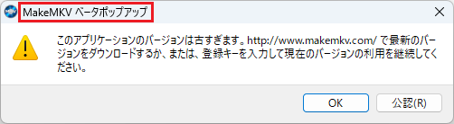
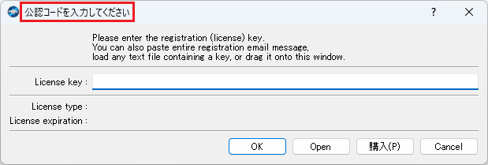

[English](README.md) | [日本語](README.ja.md)

# MakeMKV Activator

MakeMKVのアクティベーションを自動化するツール。

## 使い方

プログラムパスとウィンドウタイトルを設定してVisual Studioでビルドし、出力されたexeファイルを使用します。

実行するとMakeMKVを起動し、フォーラムからアクティベーションキーをダウンロードして適用します。  
既に適用されているアクティベーションキーが有効期限内の場合、MakeMKVを起動したままツールは終了します。

なお、フォーラムのアクティベーションキーが更新されていない場合、本ツールを利用してもアクティベーションされません。  
その際は更新を待ちましょう。1週間更新されない場合もあります。

### プログラムパスの設定

MakeMKVのファイルパスを指定します。

```csharp
private static readonly string ProgramPath = "C:\\Program Files (x86)\\MakeMKV\\makemkv.exe";
```

### ウィンドウタイトルの設定

ポップアップウィンドウのタイトルを指定します。デフォルトは日本語設定になっています。

```csharp
private static readonly string CommonPopupTitle = "MakeMKV ベータポップアップ";
```



```csharp
private static readonly string RegistrationPopupTitle = "公認コードを入力してください";
```



## ライセンス

このソフトウェアは[Unlicense](LICENSE)に基づいてライセンスされています。
