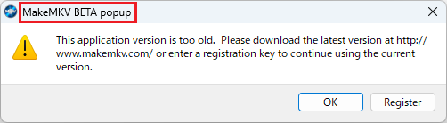
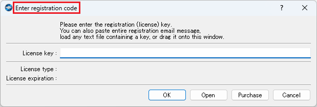

[English](README.md) | [日本語](README.ja.md)

# MakeMKV Activator

A tool to automate MakeMKV activation.

## Usage

Set the program path and window title, build the solution with Visual Studio, and use the generated executable file.

When the tool is run, MakeMKV will be launched, and the activation key downloaded from the forum will be applied.
If the activation key already applied is within the expiration date, the tool will exit with MakeMKV still running.

If the activation key in the forum has not been updated, the tool will NOT activate.
In that case, please wait for the update; it may not be updated for two weeks.

### Setting Program Path

Set the MakeMKV file path.

```csharp
private static readonly string ProgramPath = "C:\\Program Files (x86)\\MakeMKV\\makemkv.exe";
```

### Setting Window Title

Set the title of the popup window. Default is set to Japanese.

```csharp
private static readonly string CommonPopupTitle = "MakeMKV BETA popup";
```



```csharp
private static readonly string RegistrationPopupTitle = "Enter registration code";
```



## License

This software is licensed under the [Unlicense](LICENSE).
